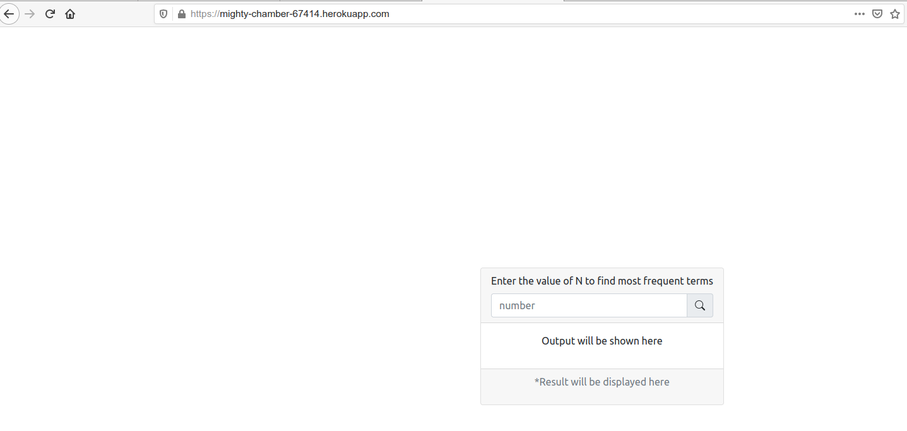
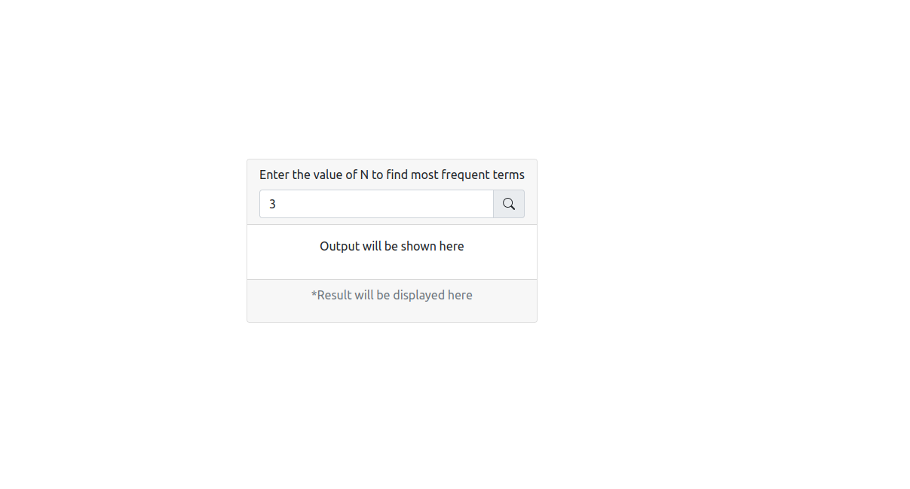
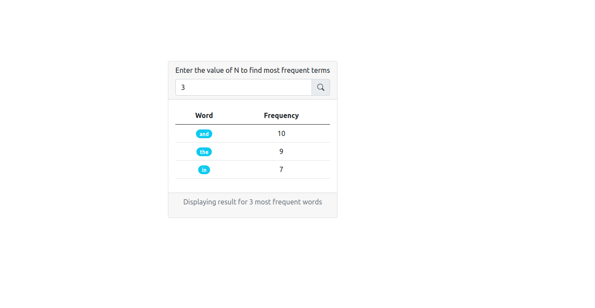

# Top N most frequent word Counter.

### [Live Project Url](https://mighty-chamber-67414.herokuapp.com)

## Project Description
It is an webapp which is in Reactjs. It accepts a number input N from the user. After entering the "n" value and pressing submit, it fetches the contents of [file](https://raw.githubusercontent.com/invictustech/test/main/README.md) and perform and algorithm on the contents of file. The algorithm counts the frequency of each word present in the file and store it in a 2D array. After this it return the top N frequent word and passes it to the frontend of the app. The frontend Displays the top N words and their frequency of occurrence in a tabular format


## The requirements of the project are as follows :- 
- A react frontend which accepts a number N
- An algorithm for frequency computation (not a ready made module for frequency computation)
- Display the most N frequent word in tabular format.

## Language Used
- Javascript

## Framework and Modules
- React JS
- Axios
- Bootstrap


## Steps to access the live project
- Go to url (https://mighty-chamber-67414.herokuapp.com)



- Enter the value of N.

 
- And Click on Submit

- Just Below the input field result will be displayed.


 

## How to install the project
#### Open VScode and open a terminal inside it and run the following steps
1. Clone this repository using the code below.
    - ```git clone https://github.com/aman2457/invic_aman.git```
  
2. Just run the below code and it will install all the dependency and start the app
   - ```npm start```


## Important Notes :- 
1. If you are not getting output on the given number there may be following reason:- 
    - Frequency computation is taking some time.(Sol --> Just click on submit again)

2. Proper comments are written inside the code for better understandings.

3. This project is divided into three major modules.
    - An user input form which accepts and integer.
        - This is getting done using simple html input field and a function *handleChange* by setting the variable named *num*.
    - An algorithm which counts the frequency and store it in a variable
        - It uses a simple function named *fetchFrequencyArr* and it sets the variable *frequencyArr*
    - A function which fetches the output from the frequencyCounter variable.
        - It is being done by using the function named *handleSubmit* which sets the variable *result*.